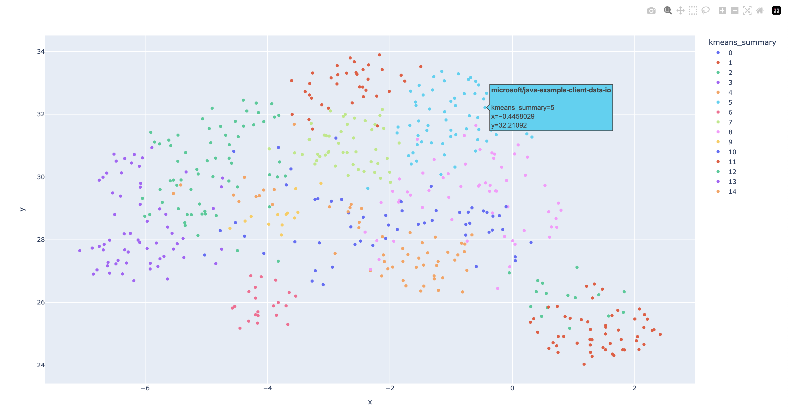
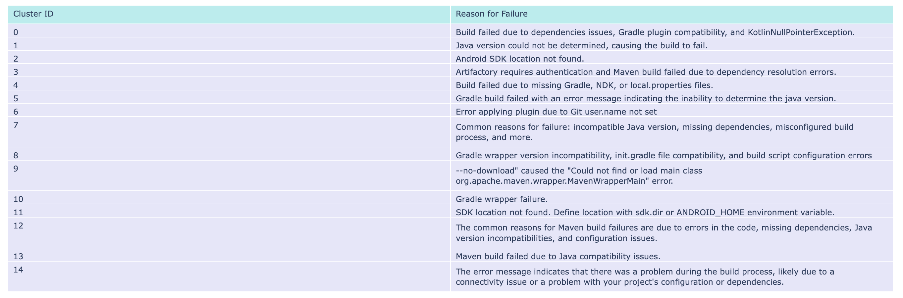

# Clustering build logs to analyse common build issues

## Goal

This project aims to analyse build logs from common build issues. By clustering these logs, you can identify common build issues and gain insight on which type of build error to prioritize. 

### Expected result

Once you have run the scripts, you will be able to open, using your browser, the results files: analysis_build_failures.html and cluster_id_reason.html. This is an example of the images what you can expect to see. 

#### analysis_build_failures.html

#### cluster_id_reason.html

## With Docker

You can build and run the clustering using docker. However, this can lead to much slower latency, due to the docker not being able to use the accelerations of Metal on Mac. You can follow the instructions in the [README](/ClusteringWithDocker/README.md) in the folder `ClusteringWithDocker` but first make sure to `cd` into the folder.

## Without Docker

You can run the same analysis without docker, by following the [README](/Clustering/README.md) instructions in the folder `Clustering`, but first make sure to `cd` into the folder.