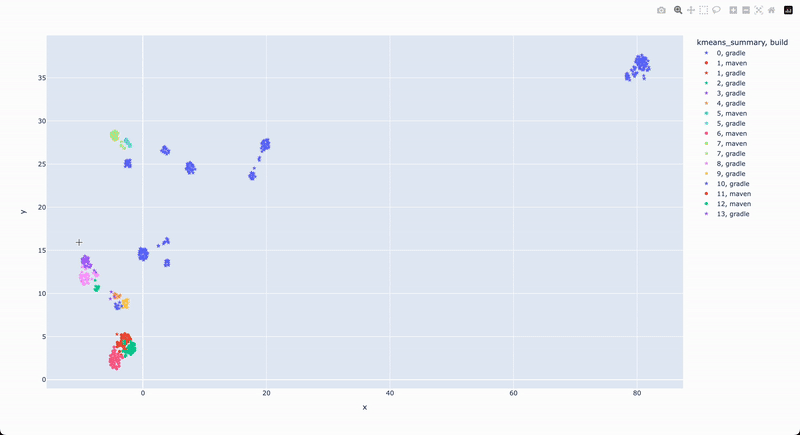

# Clustering build logs to analyze common build issues

When your company attempts to build [Lossless Semantic Trees (LSTs)](https://docs.moderne.io/administrator-documentation/moderne-platform/references/concepts/lossless-semantic-trees) for all of your repositories, you may find that some of them do not build successfully. While you _could_ go through each of those by hand and attempt to figure out common patterns, there is a better way: [cluster analysis](https://en.wikipedia.org/wiki/Cluster_analysis).

You can think of cluster analysis as a way of grouping data into easily identifiable chunks. In other words, it can take in all of your build failures and then find what issues are the most common – so you can prioritize what to fix first.

This repository will walk you through everything you need to do to perform a cluster analysis on your build failures. By the end, you will have produced two HTML files – [one that visually displays the clusters](#analysis_build_failureshtml) and [one that contains samples for each cluster](#cluster_id_reasonhtml). 

## Instructions

### Step 1: Determine how you will run this project

This project offers two options for performing cluster analysis:

1. Install a few tools (such as Python and GCC) on your local machine and then use them to generate the clusters. 
2. (**Recommended**) Generate the clusters inside a Docker container.

### Step 2: Follow the instructions for the path of your choice

* [Instructions for installing tools on your local machine](/Clustering/README.md)
* (**Recommended**) [Instructions for using Docker](/ClusteringWithDocker/README.md)

## Example results

Below you can see some examples of the HTML files produced by following the above steps.

### clusters_scatter.html

This file is a visual representation of the build failure clusters. Clusters that contain the most number of dots should generally be prioritized over ones that contain fewer dots. You can hover over the dots to see part of the build logs.

#### cluster_logs.html

To see the full extracted logs, you may use this file. This file shows all the logs that belong to a cluster.

