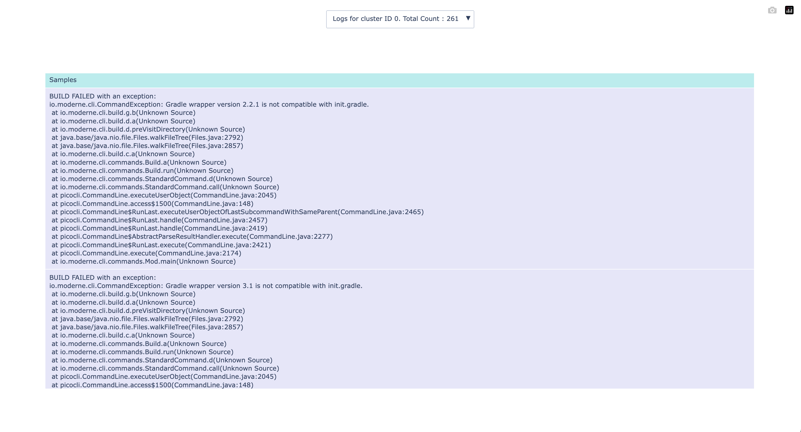

# Clustering build logs to analyze common build issues

When your company attempts to build [Lossless Semantic Trees (LSTs)](https://docs.moderne.io/administrator-documentation/moderne-platform/references/concepts/lossless-semantic-trees) for all of your repositories, you may find that some of them do not build successfully. While you _could_ go through each of those by hand and attempt to figure out common patterns, there is a better way: [cluster analysis](https://en.wikipedia.org/wiki/Cluster_analysis).

You can think of cluster analysis as a way of grouping data into easily identifiable chunks. In other words, it can take in all of your build failures and then find what issues are the most common – so you can prioritize what to fix first.

This repository will walk you through everything you need to do to perform a cluster analysis on your build failures. By the end, you will have produced two HTML files:
1. [one that visually displays the clusters](#analysis_build_failureshtml)
2. [one that contains samples for each cluster](#cluster_id_reasonhtml). 

NOTE: Clustering is currently limited to Maven or Gradle builds because our heuristic-based extraction of build errors is specific to these build types. Although build failures for other types won’t cause error when clustering, their logs might not be clustered.

## Prerequisites

> [!NOTE]
> This repository contains a devcontainer specification, it is the recommended path to get setup as it ensures a consistent developer experience. If you so choose, you can
install the necessary components locally. Running without docker might be faster, if your local machine has GPU or metal support. See [LOCAL_INSTALL.md](/LOCAL_INSTALL.md) for 
how to get started.

Please ensure you have the following tools installed on your system:

* A Devcontainer compatible client (GitHub Codespaces, GitPod, DevPod, Docker Desktop, Visual Studio Code, etc)
* Optional:
  * [Git](https://git-scm.com/downloads)


## Instructions

### Step 1: Clone this project

Most Devcontainer clients will perform the clone on your behalf as well as initializing the workspace for you. If you specific client requires you to clone the workspace locally first, then you will need to perform that task using the following.

```bash
git clone git@github.com:moderneinc/moderne-cluster-build-logs.git
cd moderne-cluster-build-logs
```

### Step 2: Gather build logs

In order to perform an analysis on your build logs, all of them need to be copied over to this directory (`Clustering`). Please ensure that they are copied over inside a folder named `repos`. 

You will also need a `build.xlsx` file that provides details about the builds such as where the build logs are located, what the outcome was, and what the path to the project is. This file should exist inside of `repos` directory.

Here is an example of what your directory should be look like if everything was set up correctly:

```
moderne-cluster-build-logs
│
├───scripts
│       (4 files)
│
└───repos
    │   builds.xlsx
    │
    ├───Org1
    │   ├───Repo1
    │   │   └───main
    │   │           build.log
    │   │
    │   └───Repo2
    │       └───master
    │               build.log
    │
    ├───Org2
    │   ├───Repo1
    │   │   └───main
    │   │           build.log
    │   │
    │   └───Repo2
    │       └───master
    │               build.log
    │
    └───Org3
        └───Repo1
            └───main
                    build.log
```


#### Using Moderne mass ingest logs

If you want to use Moderne's mass ingest logs to run this scripts, you may use the following script to download a sample.

```bash
python scripts/00.download_ingest_samples.py
```

You will be prompted which of the slices you want to download. Enter the corresponding number and press `Enter`.


### Step 3: Run the scripts

> [!WARNING]
> Please note these scripts won't function correctly if you haven't copied over the logs and `build.xlsx` file into the `repos` directory you're working out of.

**Run the following scripts in order**:

1. Load the logs and extract relevant error messages and stacktraces from the logs:

```bash
python scripts/01.load_logs_and_extract.py
```

_Please note that the loaded logs only include those generated from failures to build Maven or Gradle projects. You can open `build.xlsx` if there are less logs loaded than expected_

2. Embed logs and cluster:

```bash
python scripts/02.embed_summaries_and_cluster.py
```

### Step 4: Analyze the results

Once you've run the two scripts, you should find that a `clusters_scatter.html` and `clusters_logs.html` file were produced. Open those in the browser of your choice to get detailed information about your build failures.

```bash
python -m http.server 8080
```

Success! These can now be viewed in your browser at http://localhost:8080/clusters_scatter.html and http://localhost:8080/clusters_logs.html.

### Optional: Marking a certain repository as "solved"

As you work through the build failures, you might want to exclude logs that have been marked as solved from the clustering process. To do this, open the `failures.csv` file and set the `Solved` column to `True` for the logs you want to ignore. Alternatively, you can delete or rename the build.log file for that repository. After making these changes, restart the clustering script from step 3.

## Example results

Below you can see some examples of the HTML files produced by following the above steps.

### `clusters_scatter.html`

This file is a visual representation of the build failure clusters. Clusters that contain the most number of dots should generally be prioritized over ones that contain fewer dots. You can hover over the dots to see part of the build logs.


### `cluster_logs.html`

To see the full extracted logs, you may use this file. This file shows all the logs that belong to a cluster.


